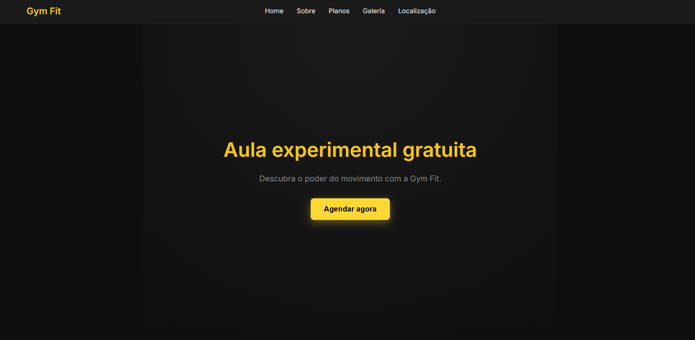
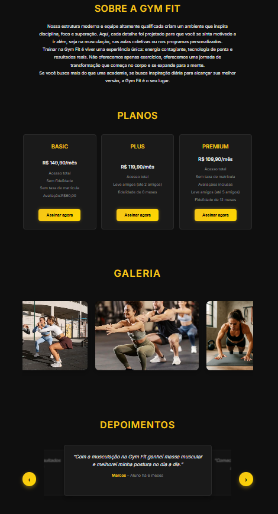

# 🏋️‍♂️ Academia GymFit

Site institucional fictício desenvolvido como projeto de portfólio, com foco em **HTML, CSS e JavaScript**.  
O site apresenta uma academia com identidade visual forte, layout responsivo e seções bem organizadas.

---

## 📁 Estrutura do Projeto

```markdown
ACADEMIA-GYMFIT/
│
├── index.html               # Página principal do site
├── README.md                # Documentação do projeto
│
├── assets/                  # Arquivos estáticos
│   ├── images/              # Imagens do site
│   └── videos/              # Vídeos caso necessários
│
├── data/                    # Dados em formato JSON
│   └── planos.json          # Informações sobre planos da academia
│
├── js/                      # Scripts JavaScript
│   ├── core/                # Funcionalidades centrais
│   │   ├── api.js           # Comunicação com APIs
│   │   ├── router.js        # Gerenciamento de rotas (SPA)
│   │   └── storage.js       # Persistência local
│   │
│   ├── modules/             # Módulos específicos do site
│   │   ├── agendamento.js   # Lógica de agendamento de aulas
│   │   ├── contato.js       # Formulário de contato
│   │   ├── depoimentos.js   # Exibição de depoimentos
│   │   ├── galeria.js       # Galeria de imagens e vídeos
│   │   ├── localizacao.js   # Mapa e endereço da academia
│   │   ├── planos.js        # Exibição e lógica dos planos
│   │   └── scrollReveal.js  # Animações de entrada com scroll
│   │
│   └── utils/               # Utilitários genéricos
│       ├── dom.js           # Manipulação de DOM
│       ├── format.js        # Formatação de dados
│       └── validator.js     # Validação de formulários
│
└── style/
    └── style.css            # Estilos principais do site
```

---

## 📸 Preview

  


---

## 🛠️ Tecnologias Utilizadas
- **HTML5** — estrutura semântica  
- **CSS3** — layout responsivo e estilização  
- **JavaScript (ES6+)** — interações básicas  
- **Google Maps Embed** — mapa interativo  
- **GitHub Pages** — hospedagem gratuita  

---

## 🚀 Como Visualizar Localmente

```bash
git clone https://github.com/YakashiDev/portfolio-gymfit.git
cd portfolio-gymfit
```

Abra o arquivo `index.html` no navegador.

---

## 🌐 Publicação com GitHub Pages
1. Vá em **Settings > Pages** no repositório  
2. Selecione a branch `main` e a pasta raiz `/`  
3. O site estará disponível em:  
👉 https://YakashiDev.github.io/portfolio-gymfit

---

## 📌 Funcionalidades
- Seção Hero com imagem de fundo personalizada  
- Apresentação dos planos via JSON  
- Galeria de imagens com destaque visual  
- Mapa interativo com localização da academia  
- Botão de rota para o Google Maps  

---

## 📄 Licença
Este projeto é apenas para fins educacionais e de portfólio.  
Imagens e nomes utilizados são fictícios e sem fins comerciais.

---

## 🤝 Autor
Desenvolvido por **YakashiDev**  
📍 Brasília, Brasil  
📧 yakashidev@gmail.com  

---

## 💡 Inspiração
Projeto inspirado na ideia de unir **design criativo** com **estrutura técnica sólida**, simulando um site real de academia com identidade visual marcante e navegação intuitiva.